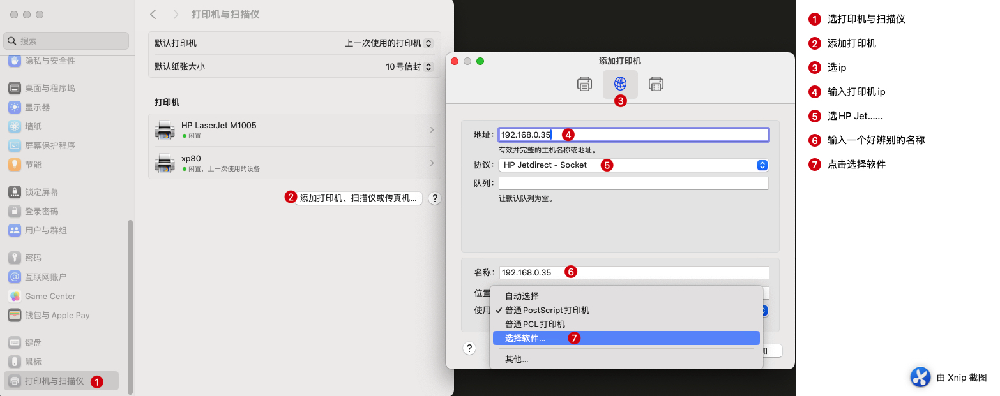
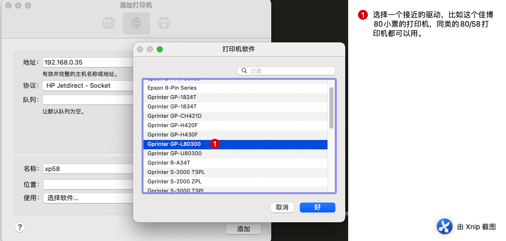

# mac安装小票打印机

参考[MAC驱动安装教程_哔哩哔哩_bilibili](https://www.bilibili.com/video/BV1sK4y1J7XL?p=1&vd_source=805d25e0693fe4bda4e25853e228c09d)

## step1 按照下图提示操作

## step2 选择一个驱动后确定

如果打印机软件为空，可以去下载[mac驱动 ](https://www.chinatsc.cn/zh-CN/downloads),之后在选择位置选择其他，选择相近驱动

